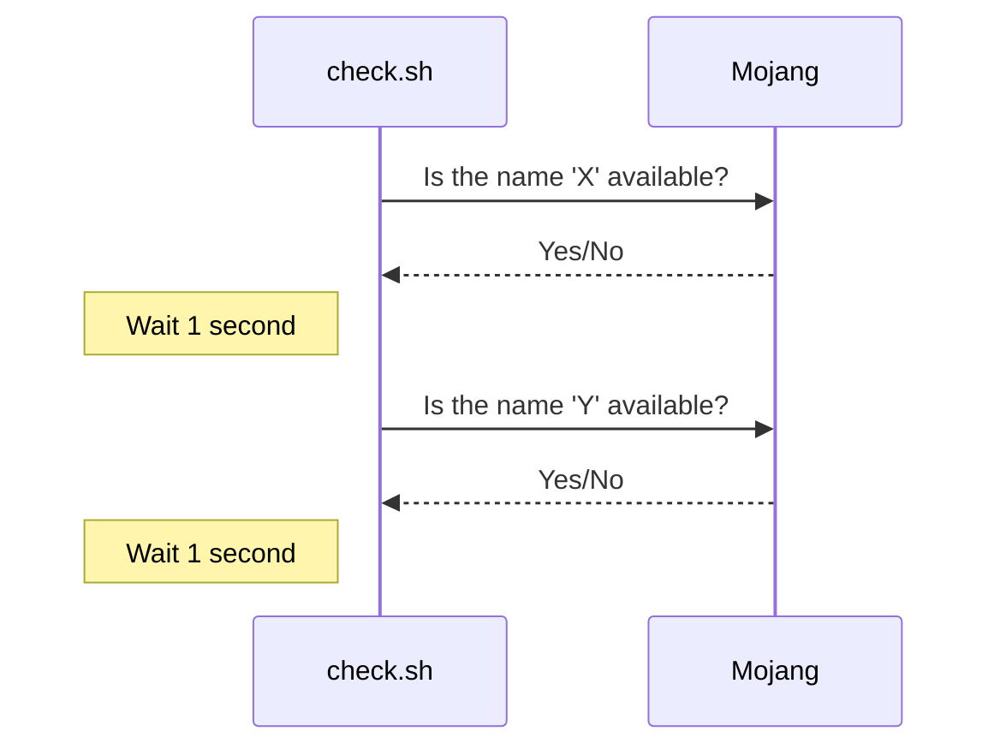

# MCnamechecker
A simple bash script designed to bulk search og/special names for name sniping/availability checking.

## Usage

- The main script, **check.sh** will loop through **names.txt,** checking the names (with a 1 second delay to avoid getting rate limited) and printing only the available ones into the terminal. Simply run
 
  > ./check.sh | tee available.txt

  and it will also print out the available names to available.txt
  
  
(Note: filter.py will strip words.txt into filtered.txt by length)

